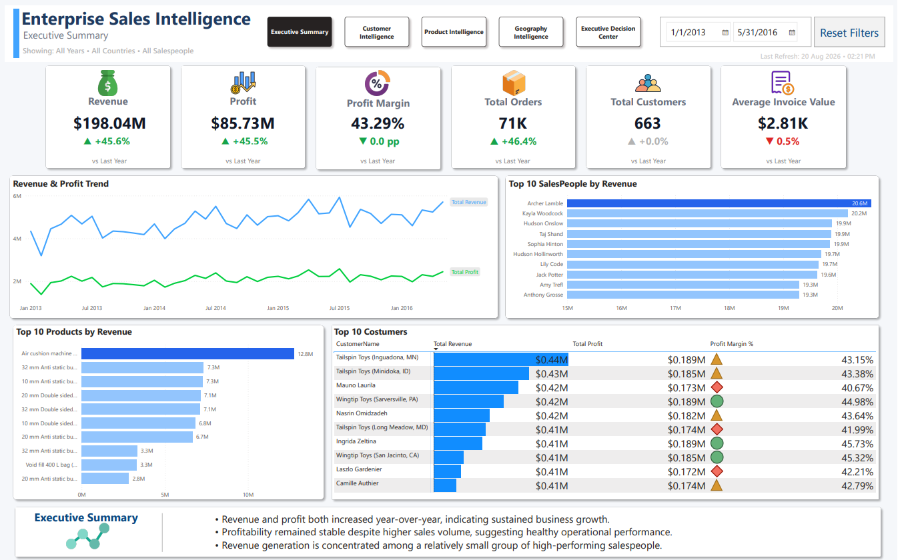
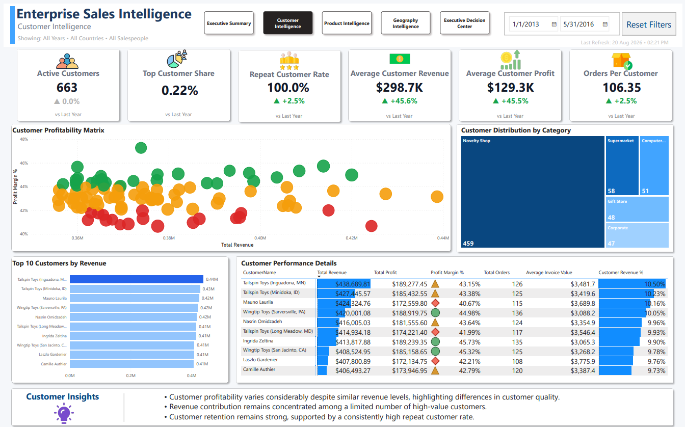
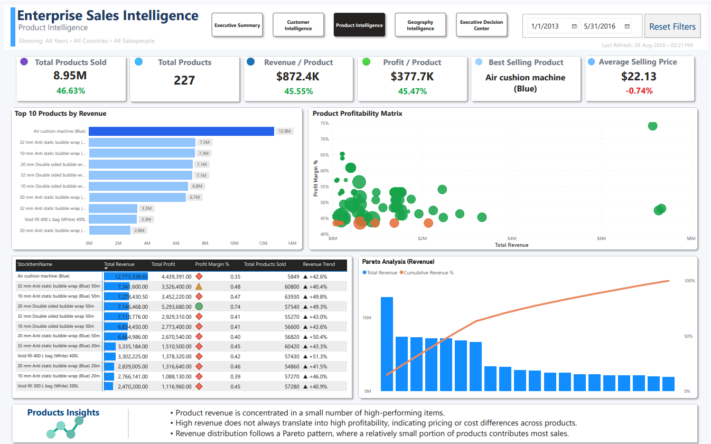
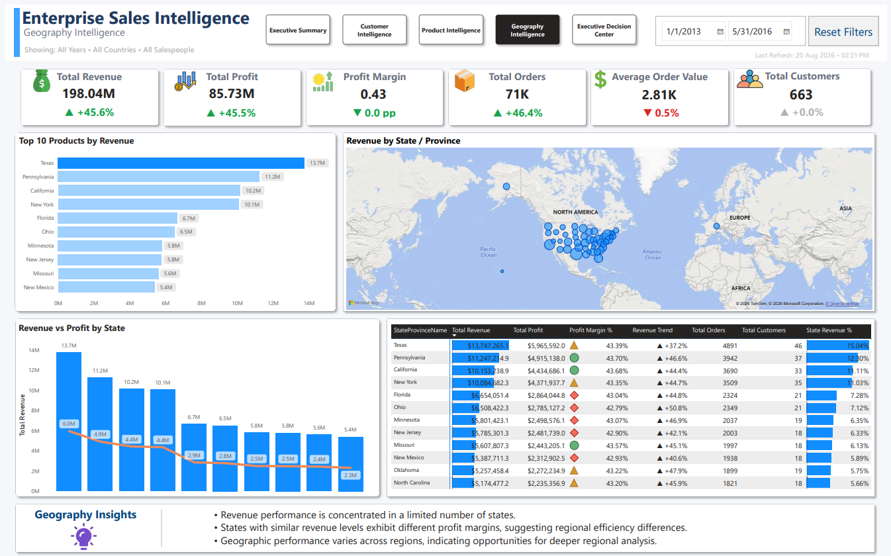
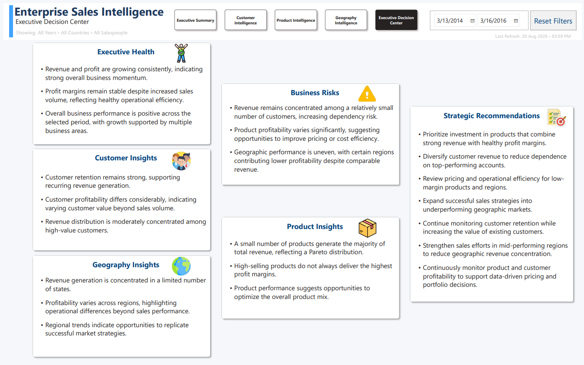

# 📊 Enterprise Sales Intelligence Dashboard


## 📖 Project Overview

The Enterprise Sales Intelligence Dashboard is an end-to-end Business Intelligence solution developed in Microsoft Power BI to transform raw enterprise sales data into actionable business insights.

The project integrates data preparation using Power Query, dimensional data modeling, advanced DAX calculations, and interactive dashboard design to provide executives with a comprehensive view of sales performance across customers, products, salespeople, and geographic regions.

The solution concludes with an Executive Decision Center that summarizes key findings and strategic recommendations, enabling faster and more informed business decisions.

## 🎯 Business Problem

Organizations often struggle to consolidate sales data into meaningful insights that support executive decision-making.

Without a centralized analytical solution, identifying high-performing customers, profitable products, regional trends, and revenue drivers becomes time-consuming and inconsistent.

This project addresses these challenges by providing a unified Business Intelligence platform that enables users to monitor performance, identify opportunities, and support strategic planning through interactive dashboards.

## 🚀 Objectives

- Analyze overall sales performance
- Monitor revenue, profit, and profitability trends
- Evaluate customer behavior and retention
- Identify top-performing and underperforming products
- Compare geographic sales performance
- Deliver executive-level business insights
- Support data-driven decision-making

## 🛠️ Tools & Technologies

| Category | Technologies |
|----------|--------------|
| Business Intelligence | Microsoft Power BI |
| Data Preparation | Power Query |
| Data Modeling | Star Schema |
| Data Analysis | DAX (Data Analysis Expressions) |
| Data Visualization | Interactive Dashboards & KPI Reporting |
| Version Control | Git & GitHub |

## 🔄 Project Workflow

```text
Raw Dataset
      │
      ▼
Power Query
(Data Cleaning & Transformation)
      │
      ▼
Data Modeling
(Star Schema)
      │
      ▼
DAX Measures
(KPIs & Business Logic)
      │
      ▼
Interactive Dashboards
      │
      ▼
Executive Decision Center
```

## 📊 Dashboard Pages

### 1. Executive Summary

Provides a high-level overview of business performance through executive KPIs, revenue trends, sales performance, and overall profitability.


---

### 2. Customer Intelligence

Analyzes customer behavior, profitability, repeat customer rate, customer concentration, and customer performance segmentation.



---

### 3. Product Intelligence

Evaluates product revenue, profitability, Pareto distribution, product performance, and pricing insights.



---

### 4. Geography Intelligence

Compares regional performance using geographic visualizations, profitability analysis, and state-level revenue distribution.



---

### 5. Executive Decision Center

Consolidates business findings into executive insights, business risks, strategic observations, and actionable recommendations to support decision-making.



## 🗂️ Data Model

The solution follows a star schema design to improve model performance, simplify relationships, and support scalable analytical reporting.

### Fact Table

- **FactSales** – Stores transactional sales records and serves as the central table for all analytical calculations.

### Dimension Tables

- **DimDate** – Calendar hierarchy and time intelligence.
- **DimCustomer** – Customer attributes and segmentation.
- **DimProduct** – Product information and categories.
- **DimSalesperson** – Sales representative details.
- **DimGeography** – Country, state, and regional attributes.

This dimensional model enables efficient filtering, reusable calculations, and simplified business analysis across multiple subject areas.

## 📈 DAX Highlights

The dashboard uses advanced DAX measures to transform raw transactional data into meaningful business insights.

### Time Intelligence

- Year-over-Year Growth
- Previous Year Comparison
- Dynamic Trend Indicators

### Financial Metrics

- Total Revenue
- Total Profit
- Profit Margin
- Average Order Value

### Customer Analytics

- Active Customers
- Repeat Customer Rate
- Revenue per Customer
- Profit per Customer
- Orders per Customer
- Top Customer Revenue Share

### Product Analytics

- Best Selling Product
- Average Selling Price
- Product Profitability
- Pareto Analysis

### Geography Analytics

- Revenue by State
- Profit by State
- Regional Profitability
- Geographic Revenue Distribution

## 💡 Key Business Insights

The dashboard enables stakeholders to:

- Monitor revenue, profit, and profitability trends.
- Identify high-value customers and customer concentration.
- Evaluate product performance using Pareto analysis.
- Compare profitability across geographic regions.
- Track business performance using dynamic KPIs.
- Support executive decision-making through consolidated business insights.

## 📁 Repository Structure
Enterprise-Sales-Intelligence/
│
├── Dashboard/
│   └── Enterprise Intelligence.pbix
│
├── Documentation/
│
├── Images/
│   ├── 01_Executive_Summary.png
│   ├── 02_Customer_Intelligence.png
│   ├── 03_Product_Intelligence.png
│   ├── 04_Geography_Intelligence.png
│   └── 05_Decision_Center.png
│
├── README.md
├── LICENSE
└── .gitignore

## 🚀 Future Improvements

Potential enhancements for future versions include:

- Real-time data integration.
- Automated data refresh using Power BI Service.
- Predictive analytics and forecasting.
- AI-generated business insights powered by Large Language Models (LLMs).
- Drill-through analysis for executive reporting.
- Row-Level Security (RLS) for role-based dashboard access.

## 👨‍💻 Author

**Mohamad Moussa**

Electrical Engineer | Business Intelligence & Data Analytics | Power BI Developer

- GitHub: [Mohamad-Moussa](https://github.com/Mohamad-Moussa)
- LinkedIn: [Mohamad Abas Moussa](https://www.linkedin.com/in/mohamad-abas-moussa/)